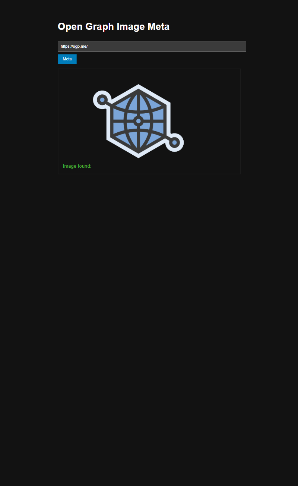
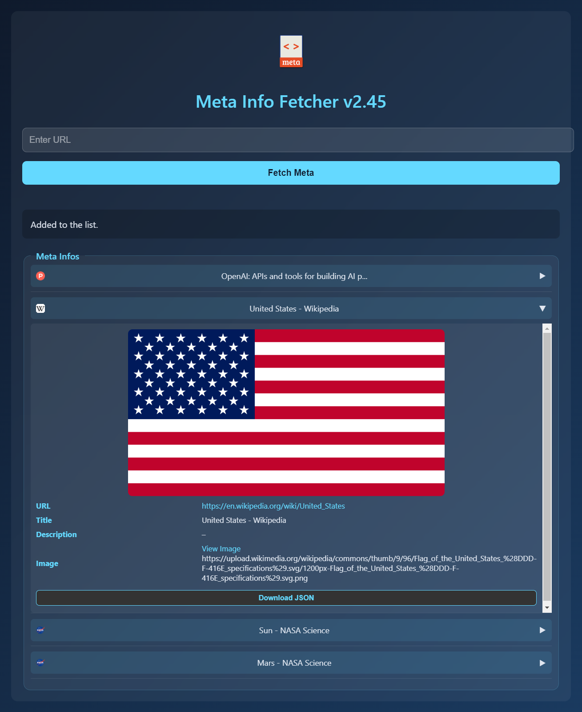

# Py-Flask-Meta
Open Graph Meta API (Image, OG, etc)



A lightweight Flask service that extracts Open Graph (`og:*`) metadata from URLs, such as `og:image`, `og:title`, and `og:description`. It intelligently caches HTML (60 days) and metadata (permanent) to optimize performance and reduce redundant requests.

Supports fallback "curl" browser impersonation for sites with bot detection.

Version 2 is also available for Advance Users.
It has more features like multiple urls checking.




---

## 🚀 Sample API Usage

### JavaScript (Fetch)
```js
fetch('http://localhost:5000/meta', {
  method: 'POST',
  body: new URLSearchParams({ url: 'https://ogp.me/' })
})
.then(res => res.json())
.then(data => console.log(data['og:image']));
```

### curl
```bash
curl -X POST http://localhost:5000/meta \
  -d "url=https://ogp.me/"
```

### Python
```python
import requests

response = requests.post('http://localhost:5000/meta', data={
    'url': 'https://ogp.me/'
})
print(response.json()['og:image'])
```

☕ [Buy me a coffee](https://www.buymeacoffee.com/fedmich)   
